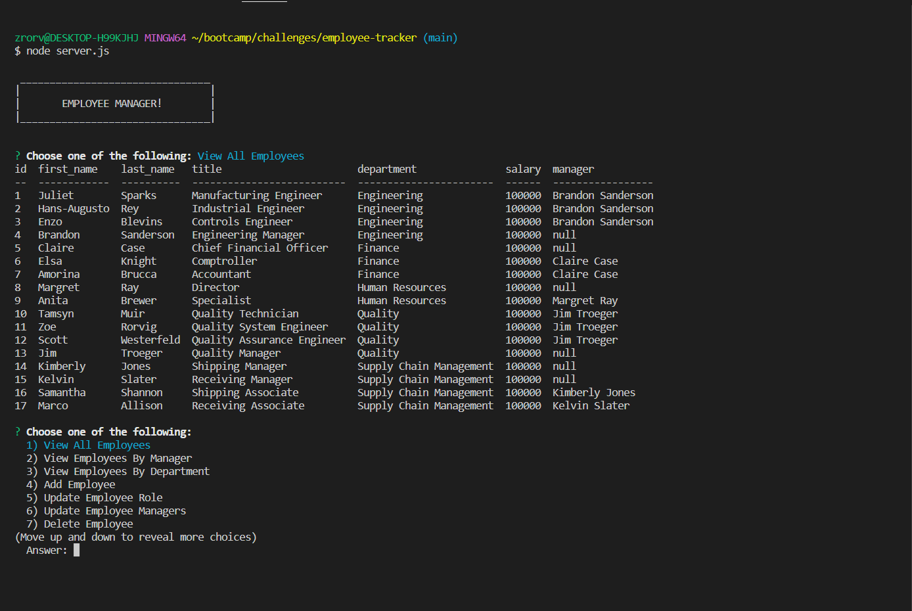

# Employee Tracker

## Table of Contents
- [Description](#description)
- [Instructions](#instructions)
- [Visuals](#visuals)

## Description 
This application is used to store and view database information for a company, including department, roles, and employees. 

Features Include:
- The ability to choose different viewing and editing options for the employee databases. 
- Viewing Options Include:
    - View All Employees - Displays a list of employees
    - View Employees By Manager - Filters employees by manager
    - View Employees By Department - Filters employees by department
    - View All Roles - Displays a list of roles
    - View All Departments - Displays a list of departments
    - View Total Utilized Budget By Department - Shows the total employee salary based on department
- Editing Options Include:
    - Add Employee - Adds a new employee to the respective table
    - Update Employee Role - Updates a chosen employees role
    - Update Employee Manager - Updates a chosen employees manager
    - Delete Employee - Deletes a chosen employee
    - Add Role - Adds a new role to the respective table
    - Delete Role - Deletes a chosen role
    - Add Department - Adds a new department to the respective table
    - Delete Department - Deletes a chosen department

## Instructions
- To create and seed the database/tables:
    - Enter "mysql -u root" into the command terminal
    - Once the mysql terminal opens, enter "source db/schema.sql" and "source db/seeds.sql"
    - Enter "exit" to return to the original command terminal. 
- Enter "node server.js" to run the application. 

## Visuals 

The following is a link to a video demo:

[Walkthrough Video](https://drive.google.com/file/d/1_unr1aTXNqqHIZHFHQuApBj3QDapAz3m/view)

The following is a screenshot of the application:

